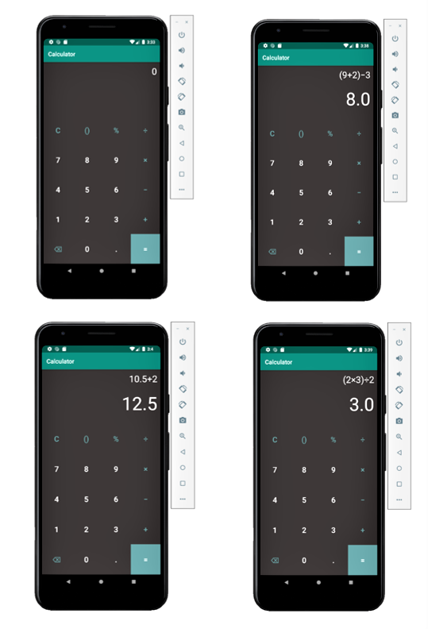

# Calculator_app
A simple calculator app for android phones.

Funtionalities:
- Can perform basic calculations such as addition, substraction, multiplication, division and ampersand.
- can perform calculations using bracket and decimals.
- contains backspace button to make changes during calculation.

The images below shows an overview of this app

